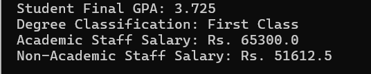

# 🎓 University Person Management System (Java)

A Java console application modeling a university ecosystem with `Person`, `Student`, `AcademicStaff`, and `NonAcademicStaff`. Demonstrates OOP fundamentals—**abstraction**, **inheritance**, and **polymorphism**—through GPA and salary calculations.

---

## ⚙️ Key Concepts

- `abstract class` inheritance
- `method overriding`
- Student GPA computation
- Staff salary logic with allowances and overtime

---

## 🧪 Sample Output


---

## 🚀 How to Run

1. Save code as `PersonDemo.java`
2. Compile:
   ```bash
   javac PersonDemo.java
```
3. Run:
 ```bash
   java PersonDemo
```
## ✍️ Author
**S.D.Tasuntha Chathunika** 
🎓 University of Vavuniya – Faculty of Information and Communication Technology  
📅 Date: 2025-06-09
🔗 [GitHub Profile](https://github.com/Tasuntha-Chathunika)


---

### 📌 Next Steps

1. Create the new repo on GitHub with the **above name** and a **checked “Add README”**.
2. Upload `PersonDemo.java` and the `README.md`.
3. **Pin** the repo to your profile (in Settings → Profile).
4. ⭐ For visibility, add a few small Java projects (like `Food Order App`, `Palindrome Checker`) too.

---

### 🎯 Final Answer for Your Friend

> To add your polished Java OOP project to your GitHub profile like a pro:
> 1. Name the repo `university-person-management-java`, with a clear summary.
> 2. Upload both your `PersonDemo.java` and a professional `README.md`.
> 3. Push, commit, and **pin** the repo to your GitHub profile.
> 4. Share that link on your CV or portfolio—it’ll showcase both your coding plus your version control skills.

Need help generating the code folder or pushing via CLI? Just ping me—I'd be glad to assist!

